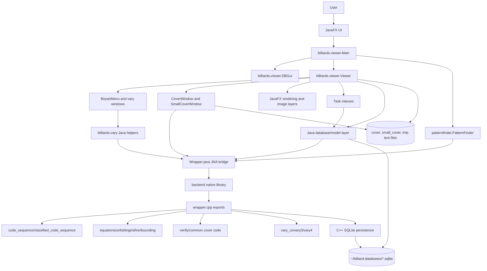
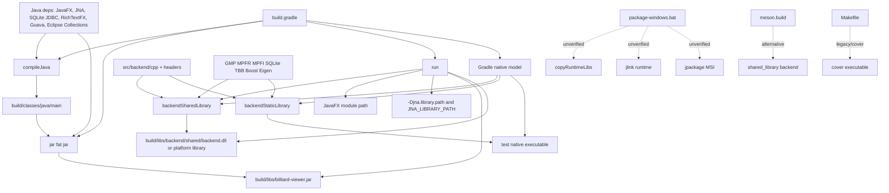
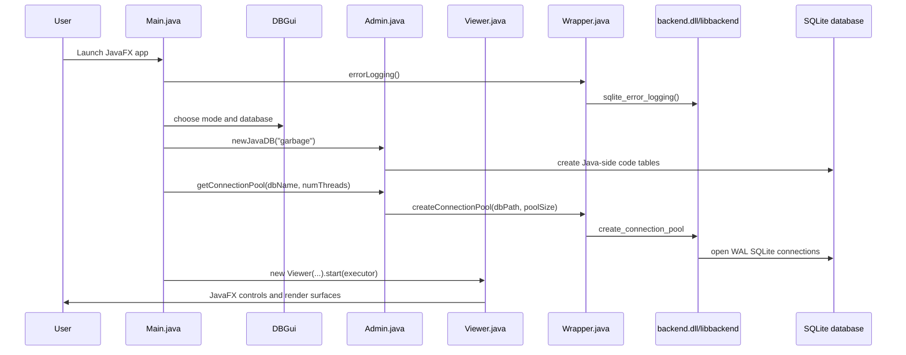
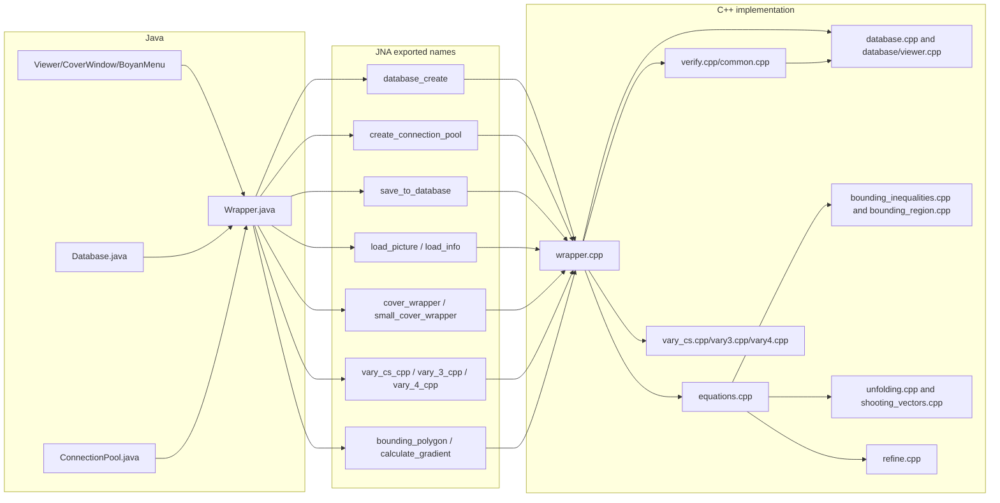
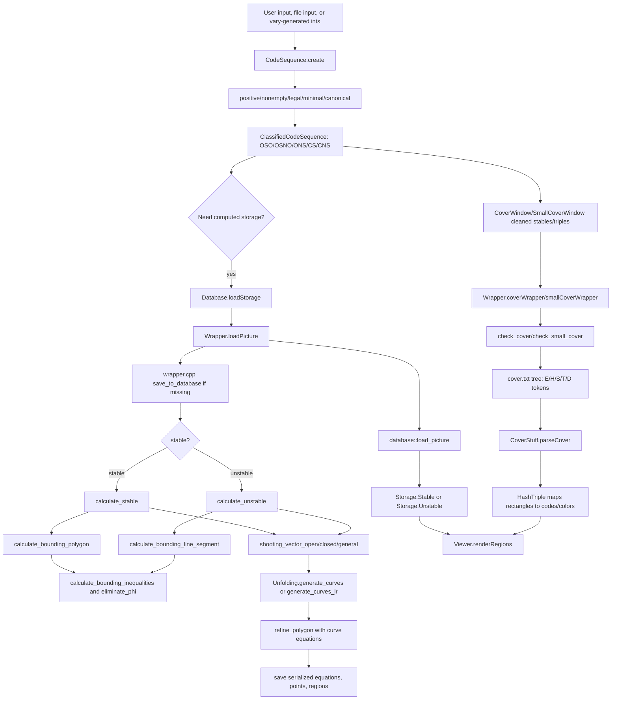
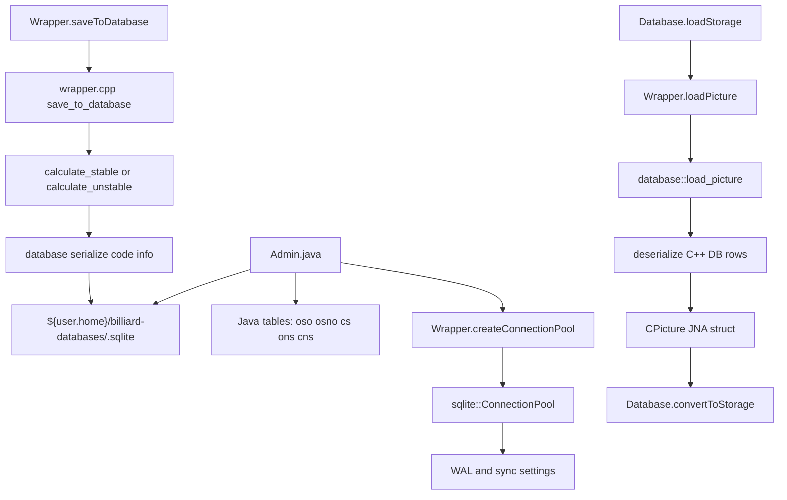
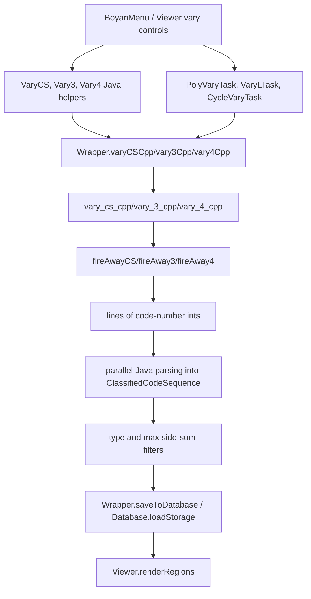

# Architecture Graph

## Evidence anchors

These diagrams are based on verified source/build/runtime evidence:

- `build.gradle:15-17`, `35-43`, `98-120`, `187-232`
- `src/java/billiards/viewer/Main.java:21-65`
- `src/java/billiards/wrapper/Wrapper.java:36-667`
- `src/backend/cpp/wrapper.cpp:123-1296`
- `src/java/billiards/database/Admin.java:23-93`
- `src/java/billiards/database/Database.java:313-397`
- `src/java/billiards/viewer/Viewer.java:590-608`, `5787-5968`, `7997-8042`
- `src/backend/cpp/equations.cpp`, `database.cpp`, `unfolding.cpp`, `bounding_inequalities.cpp`, `bounding_region.cpp`, `verify.cpp`, `vary_cs.cpp`, `vary3.cpp`, `vary4.cpp`
- Runtime `run.bat`, `run2.bat`, `runDEBUG.bat`

## A. Full project component graph

## B. Build/dependency graph

Notes:

- `run.dependsOn "backendSharedLibrary"` is in `build.gradle:187`.
- `applicationDefaultJvmArgs` includes `-Djna.library.path=./build/libs/backend/shared/` at `build.gradle:98`.
- On Windows, dependent DLL discovery must also be handled through `PATH`, as the runtime scripts do.

## C. Runtime graph

## D. Java-to-C++ bridge graph

## E. Math/data pipeline graph

## F. Database persistence graph

## G. Vary/search graph

Warning: `Wrapper.varyCSCpp` uses a synchronized list while parsing native result lines. `Wrapper.vary3Cpp` and `Wrapper.vary4Cpp` use `parallel()` with a plain `ArrayList`, which is a likely concurrency bug.

