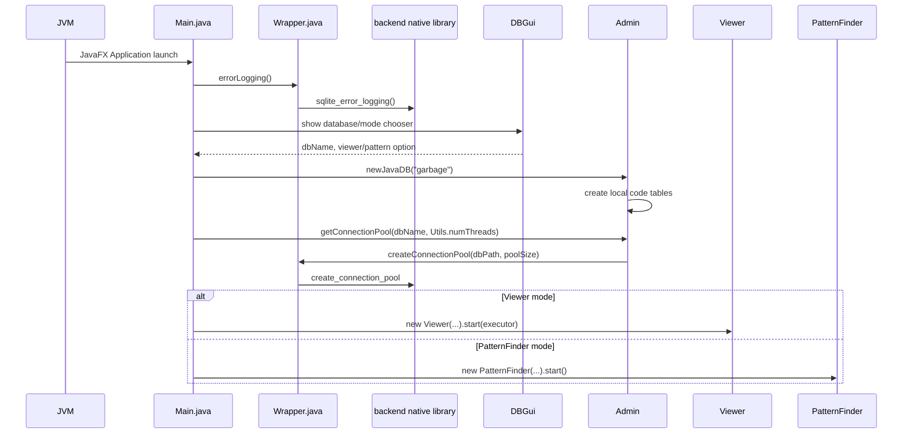
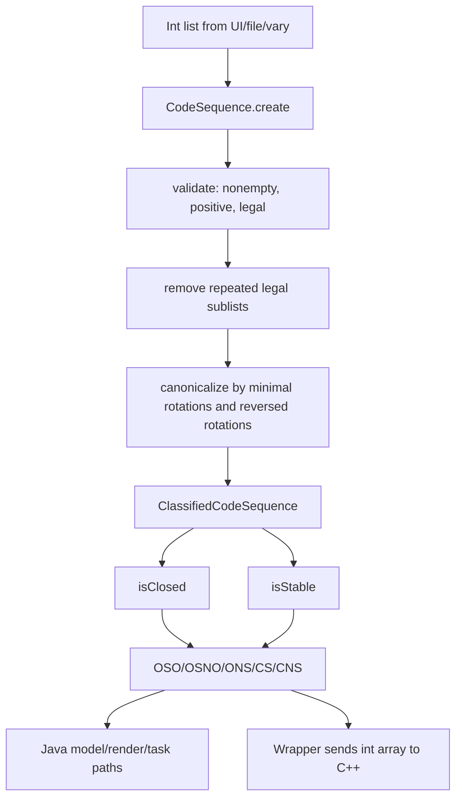
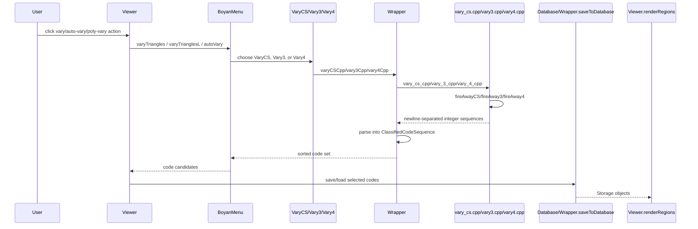
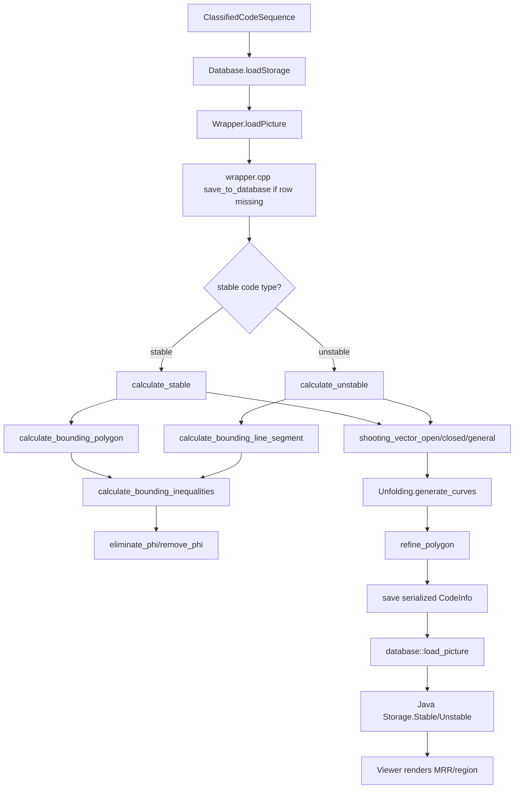
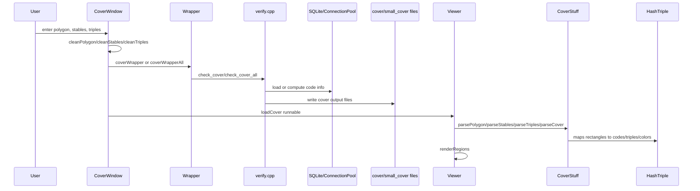
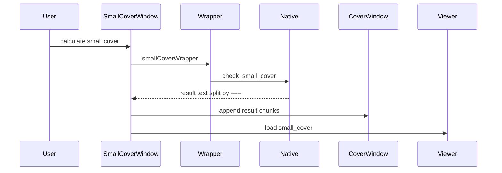
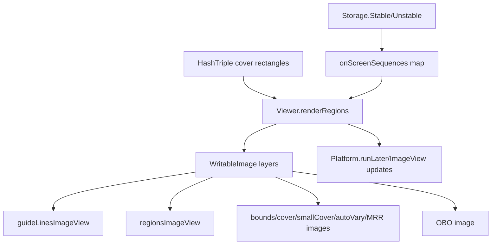
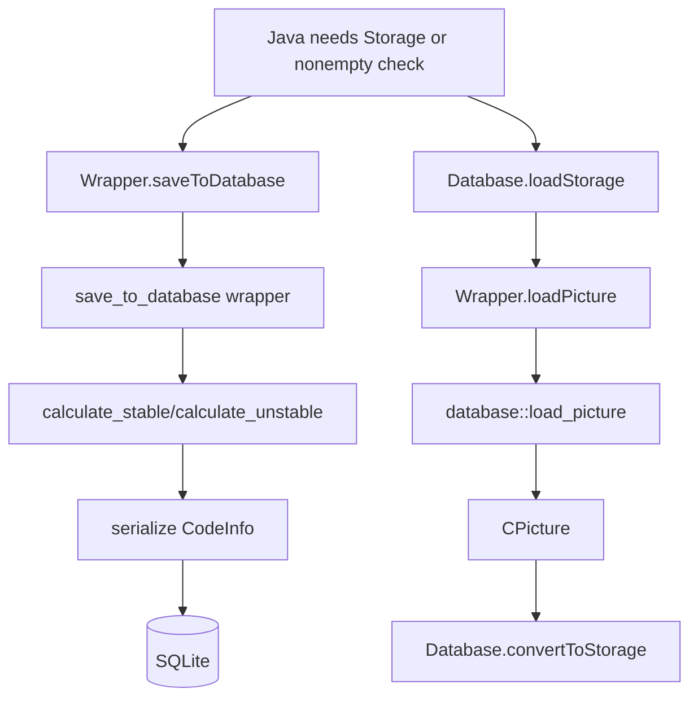

# Main Code Paths

## A. Application startup path

Files/classes/functions:

- `src/java/billiards/viewer/Main.java:21` has Abdul version string `10.0.14`.
- `Main.init()` calls `Wrapper.errorLogging()` at `Main.java:29-30`.
- `Main.start(Stage)` creates the startup UI, calls `Admin.newJavaDB("garbage")`, creates a connection pool, and starts `Viewer` or `PatternFinder` at `Main.java:34-55`.
- `Main.stop()` destroys the pool and shuts down the executor at `Main.java:65`.
- `Admin.databaseDir` is `${user.home}/billiard-databases` at `Admin.java:23`.
- `Admin.getConnectionPool` calls native pool creation through `Wrapper`.
- `Wrapper.java:36` runs `Native.register("backend")`.

Data structures:

- `ConnectionPool` wraps a JNA `Pointer` to native `sqlite::ConnectionPool`.
- The startup database `garbage` contains Java-side code-list tables `oso`, `osno`, `cs`, `ons`, and `cns`.

Debug breakpoints:

- `Main.init`
- `Main.start`
- `Wrapper.<clinit>` / first `Wrapper.errorLogging`
- `Admin.newJavaDB`
- `Admin.getConnectionPool`
- Native `sqlite_error_logging`
- Native `create_connection_pool`

Likely failure points:

- Missing `backend.dll` or dependent native DLLs.
- JavaFX module path missing.
- Database directory permission issue under `${user.home}/billiard-databases`.

## B. Code sequence calculation path

Java entry points:

- `CodeSequence.create(IntList)` validates and canonicalizes code numbers.
- `CodeSequence.validate` rejects invalid input.
- `CodeSequence.isLegal` checks the angle-walk legality condition.
- `ClassifiedCodeSequence` computes `codeLength`, `codeSum`, `codeType`, `stable`, and `oddEvenPattern`.
- `ClassifiedCodeSequence.calculateCodeType` chooses `OSO`, `OSNO`, `ONS`, `CS`, or `CNS`.
- `ClassifiedCodeSequence.isClosed` and `isStable` implement closed/stable classification.

Native mirror:

- `src/backend/cpp/code_sequence.cpp`
- `src/backend/cpp/classified_code_sequence.cpp`

Data structures:

- Java: `IntList`, `CodeSequence`, `ClassifiedCodeSequence`, `CodeType`.
- C++: `CodeSequence`, `CodeType`, vectors of `CodeNumber`, angle coefficient structures.

What is computed:

- Whether a user sequence is legal.
- The canonical representative of a sequence, including reversed rotations.
- Whether the code is open/closed and stable/unstable.
- Which DB table and native algorithm path should be used.

Debug breakpoints:

- Java `CodeSequence.create`
- Java `CodeSequence.isLegal`
- Java `ClassifiedCodeSequence.calculateCodeType`
- Java `ClassifiedCodeSequence.isClosed`
- Java `ClassifiedCodeSequence.isStable`
- C++ `CodeSequence::create`
- C++ `ClassifiedCodeSequence::create` or equivalent classification functions

Likely failure points:

- UI text parsing before `CodeSequence.create`.
- Illegal sequences silently filtered by callers.
- Java/C++ classification divergence if either implementation changes.

## C. Vary/varys path

UI entry points:

- `BoyanMenu.varyTriangles` at `BoyanMenu.java:567` and overloads.
- `BoyanMenu.varyTrianglesL` at `BoyanMenu.java:613` and overloads.
- `BoyanMenu.autoVary` at `BoyanMenu.java:657` and `693`.
- `Viewer.java:7095` and `7373` create `PolyVaryTask`.
- `Viewer.java:4430` creates `VaryLTask`.
- `CycleVaryTask` is used through cycle vary UI paths.

Native calls:

- `Wrapper.varyCSCpp` -> native `vary_cs_cpp` -> `fireAwayCS` in `vary_cs.cpp:209`.
- `Wrapper.vary3Cpp` -> native `vary_3_cpp` -> `fireAway3` in `vary3.cpp:178`.
- `Wrapper.vary4Cpp` -> native `vary_4_cpp` -> `fireAway4` in `vary4.cpp:200`.

Data structures:

- Angles and initial positions are passed as Java doubles to native.
- Native returns line-oriented integer code sequences.
- Java parses each line into `CodeSequence` and `ClassifiedCodeSequence`.
- Tasks use `Storage` objects loaded through `Database.loadStorage`.

Performance-sensitive sections:

- Native `fireAway*` functions.
- Java parsing of large native result strings.
- `PolyVaryTask` and `VaryLTask` storage loading with executors.
- Pixel filtering in `PolyVaryTask`.

Important risk:

- `Wrapper.varyCSCpp` uses `Collections.synchronizedList(new ArrayList<>(estimatedLines))` before parallel parsing.
- `Wrapper.vary3Cpp` and `Wrapper.vary4Cpp` use `new ArrayList<>(estimatedLines)` with `Arrays.stream(...).parallel().forEach(...)`, which is not thread-safe.

Debug breakpoints:

- Java `BoyanMenu.varyTriangles`, `varyTrianglesL`, `autoVary`
- Java `Wrapper.varyCSCpp`, `vary3Cpp`, `vary4Cpp`
- Native `vary_cs_cpp`, `vary_3_cpp`, `vary_4_cpp`
- Native `fireAwayCS`, `fireAway3`, `fireAway4`
- Java `PolyVaryTask.call`, `VaryLTask.call`, `CycleVaryTask.call`
- Java `Database.loadStorage`

## D. MRR calculation path

Mathematical meaning in this codebase:

- For stable codes, the code has a two-dimensional region in angle space. Java represents the result as `Storage.Stable` with equations, points, and a `ConvexPolygon`.
- For unstable codes, the code has a one-dimensional constraint/segment. Java represents it as `Storage.Unstable` with equations, a constraint, a `LineSegment`, and points.
- MRR-related rendering is driven by the computed storage and optional outer bounding polygon from native `bounding_polygon`.

Files/functions:

- Java entry: `Database.loadStorage` at `Database.java:313`.
- Native bridge: `Wrapper.loadPicture` at `Wrapper.java:299`.
- Native wrapper: `wrapper.cpp:477` `load_picture`; `wrapper.cpp:253-369` save helpers.
- Stable math: `equations.cpp` `calculate_stable`.
- Unstable math: `equations.cpp` `calculate_unstable`.
- Bounding region: `bounding_region.cpp:612` `calculate_bounding_polygon`, `bounding_region.cpp:481` `calculate_bounding_line_segment`.
- Inequalities: `bounding_inequalities.cpp:126` `eliminate_phi`, `bounding_inequalities.cpp:281` `calculate_bounding_inequalities`.
- Unfolding: `unfolding.cpp:345`, `415`, `491`, `579` generate curve variants.
- Refinement: `refine.cpp:520` `refine_polygon`.

Intermediate representations:

- `LinComArrZ<XYEtaPhi>`, `LinComArrZ<XYEta>`, `Equation<Sin>`, `Equation<Cos>`.
- `InitialAngles`, `LeftRight`, `Curves`, `CurvesLR`.
- `RationalPolygon`, `IntervalPolygon`, `RationalLineSegment`.
- Java `ConvexPolygon`, `LineSegment`, `Equation`, `Point`, `Storage`.

Likely error locations:

- Code classification mismatch between Java and native.
- `eliminate_phi` memory/performance or dedup behavior.
- Exact/rational to interval/double conversion.
- `refine_polygon` returning empty unexpectedly.
- Native save/load mismatch in serialized SQLite rows.

Debug breakpoints:

- Java `Database.loadStorage`
- Java `Wrapper.loadPicture`
- Native `load_picture`
- Native `save_to_database`
- Native `calculate_stable`, `calculate_unstable`
- Native `calculate_bounding_polygon`, `calculate_bounding_line_segment`
- Native `eliminate_phi`
- Native `Unfolding::generate_curves`
- Native `refine_polygon`

## E. Cover calculation path

Small cover path:

Files/functions:

- Java UI: `CoverWindow.java`, `SmallCoverWindow.java`.
- Cover calculate button in `CoverWindow.java` calls `Wrapper.coverWrapper`, `coverWrapperDiagonal`, `coverWrapperHalf`, or `coverWrapperAll`.
- `CoverWindow.cleanTriples` and related helpers call `Wrapper.saveToDatabase` for stable/unstable code components.
- `SmallCoverWindow` calls `Wrapper.smallCoverWrapper`.
- Native wrappers: `wrapper.cpp:123`, `150`, `199`, `221`, `242`.
- Native implementation: `verify.cpp:766` `check_cover`, `verify.cpp:1053` `check_small_cover`, `verify.cpp:1295` `check_cover_all`.
- Recursive cover helpers: `verify.cpp:288` and `common.cpp:785` `cover_square`.
- Java parse: `CoverStuff.parseCover`, `parseStables`, `parseTriples`, `parseHalfTriples`.
- Render storage: `HashTriple`, then `Viewer.renderRegions`.

Data structures:

- Text files: `polygon.txt`, `square.txt`, `stables.txt`, `triples.txt`, `cover.txt`.
- Cover tree tokens: `E`, `H`, `S`, `T`, `D`.
- Rectangle maps: stable, triple, half-triple, color maps in `HashTriple`.

Known memory/performance issues:

- Huge `cover.txt` files can contain tens of millions of tokens.
- Runtime patched `HashTriple.class` differs only from unpatched runtime class and appears designed to reduce color-map memory and provide default color fallback.
- Abdul source `HashTriple.remove(Rectangle)` removes stable/triple/half-triple entries but not `colorMap`, so stale color entries may accumulate.

Debug breakpoints:

- Java `CoverWindow` calculate handler
- Java `SmallCoverWindow` calculate handler
- Java `CoverWindow.cleanTriples`
- Java `Wrapper.coverWrapper`, `smallCoverWrapper`, `coverWrapperAll`
- Native `cover_wrapper`, `small_cover_wrapper`, `check_cover`, `check_small_cover`, `cover_square`
- Java `Viewer.loadCover`
- Java `CoverStuff.parseCover`
- Java `HashTriple.addStables`, `addTriples`, `getColor`
- Java `Viewer.renderRegions`

## F. Viewer/rendering path

Files/functions:

- `Viewer.renderRegions` starts at `Viewer.java:5787`.
- `Viewer.calculateCurrentCodeNumbers` starts at `Viewer.java:5923`.
- `Viewer.loadCover` starts at `Viewer.java:7997`.
- `Viewer.loadCoverWithoutTrim` starts at `Viewer.java:8023`.
- `Viewer.java:5282-5439` contains cover rectangle to storage/color lookup logic.
- `Viewer.java:2647-2683` sets up the reflection checkbox and adds `Affine` transforms.
- `Viewer.java:3928-3932` adds another reflection transform in `start`.

Data structures:

- `LinkedHashMap<Storage, Color> onScreenSequences`
- `HashTriple coverRects`
- JavaFX `WritableImage`, `ImageView`, `Affine`
- `ConvexPolygon`, `Rectangle`, `LineSegment`, `Storage`

What becomes visible:

- Stable/unstable MRR regions.
- Cover rectangles.
- Small-cover areas.
- Auto-vary polygons.
- Bounds and MRR overlays.
- OBO image layers and guide lines.

Debug breakpoints:

- `Viewer.renderRegions`
- `Viewer.renderPolygon`
- `Viewer.renderRectLoad`
- `Viewer.loadCover`
- `CoverStuff.parseCover`
- `HashTriple.getColor`
- `Viewer.calculateCurrentCodeNumbers`

Likely failure points:

- Null color from `HashTriple.getColor` in Abdul source if a rectangle has no `colorMap` entry.
- Excess memory during huge cover parse/render.
- JavaFX thread violations if UI updates happen outside `Platform.runLater`.
- Repeated reflection transforms due to multiple add paths.

## G. Database save/load path

Files/functions:

- Java `Database.loadStorage`: `Database.java:313`.
- Java `Database.saveToDatabase`: `Database.java:397`.
- Java `Wrapper.saveToDatabase`: `Wrapper.java:254`, `276`.
- Java `Wrapper.loadPicture`: `Wrapper.java:299`.
- Native `wrapper.cpp:350` `save_to_database`.
- Native `wrapper.cpp:477` `load_picture`.
- Native `database.cpp:398` static save helper.
- Native `database/viewer.cpp:145` `database::load_picture`, `database/viewer.cpp:157` `database::load_info`.

Important behavior:

- `load_picture` calls `save_to_database` first if needed, so loading can trigger expensive computation.
- Native DB connection pool uses SQLite WAL settings in wrapper/database setup.
- Java model conversion is a separate step after native deserialization into C structs.

Debug breakpoints:

- Java `Database.loadStorage`
- Java `Wrapper.loadPicture`
- Native `load_picture`
- Native `save_to_database`
- Native `database::load_picture`
- Java `Database.convertToStorage`

